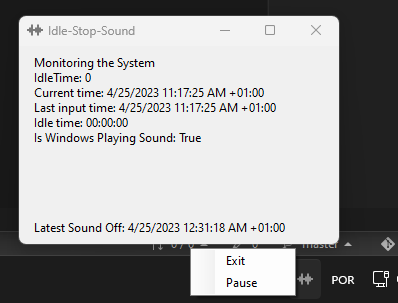

# IdleStopSound

IdleStopSound is a app that help Windows go to sleep mode

Default: trigger every 20seg to check if user are idle. if idle time is grand than 2 minutes. 
it automatically stop sound and it will allow windows go to sleep process

#Motivation
Spotify is preventing Windows from sleeping [https://community.spotify.com/t5/Desktop-Windows/Spotify-is-preventing-Windows-from-sleeping/td-p/5012284]

